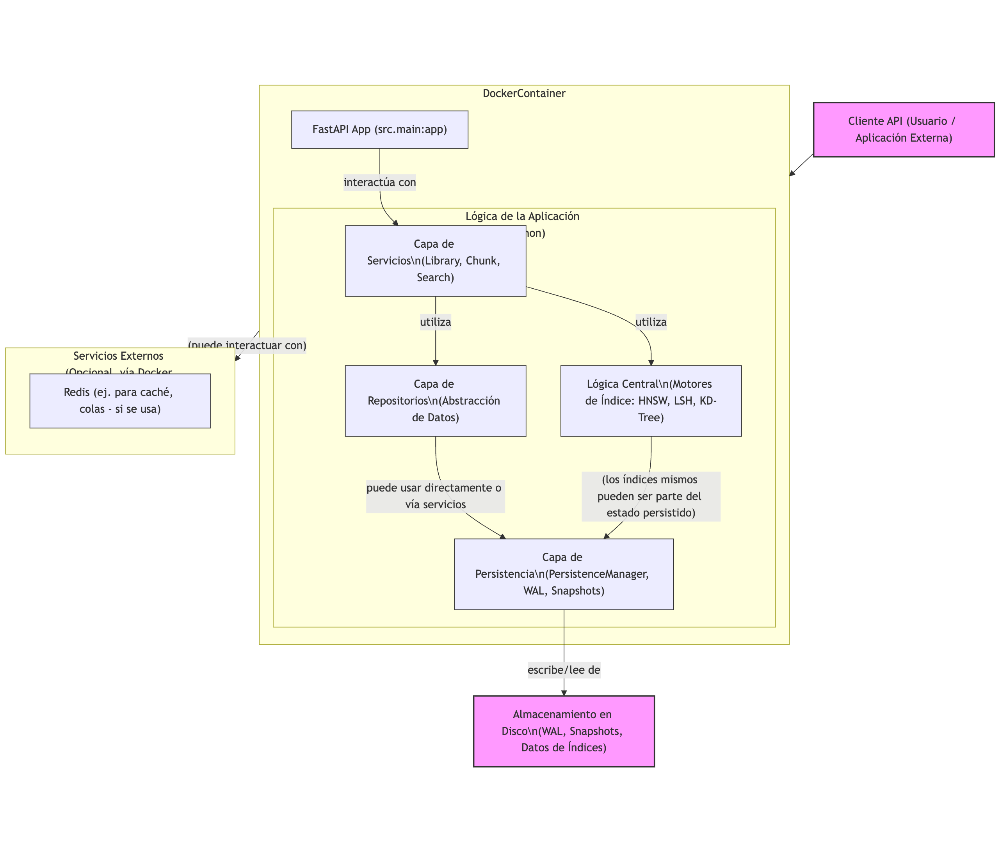
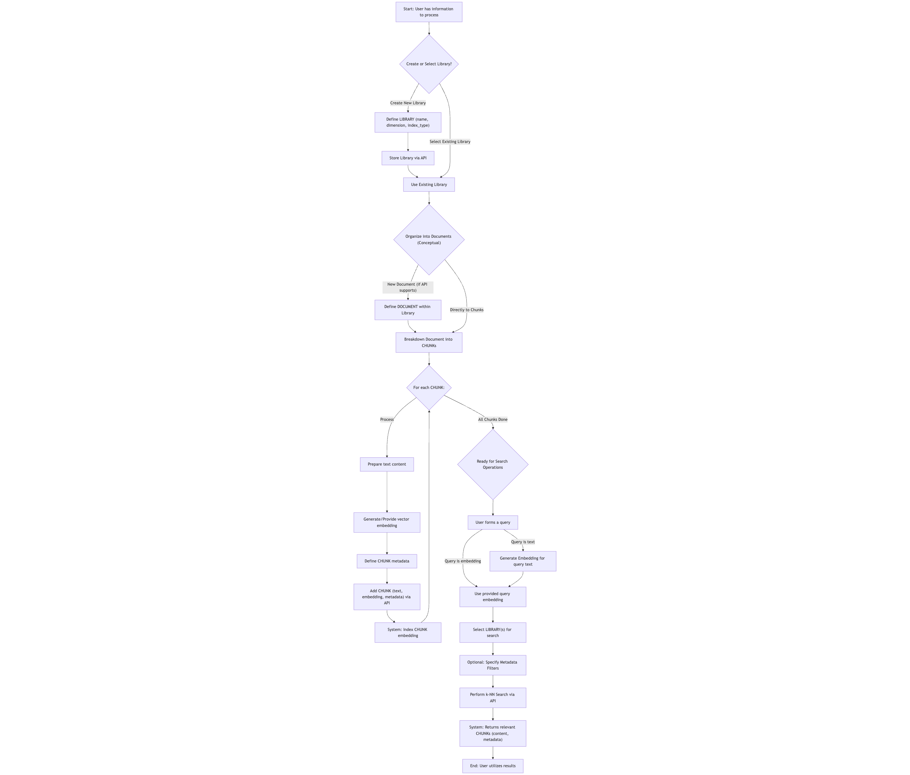
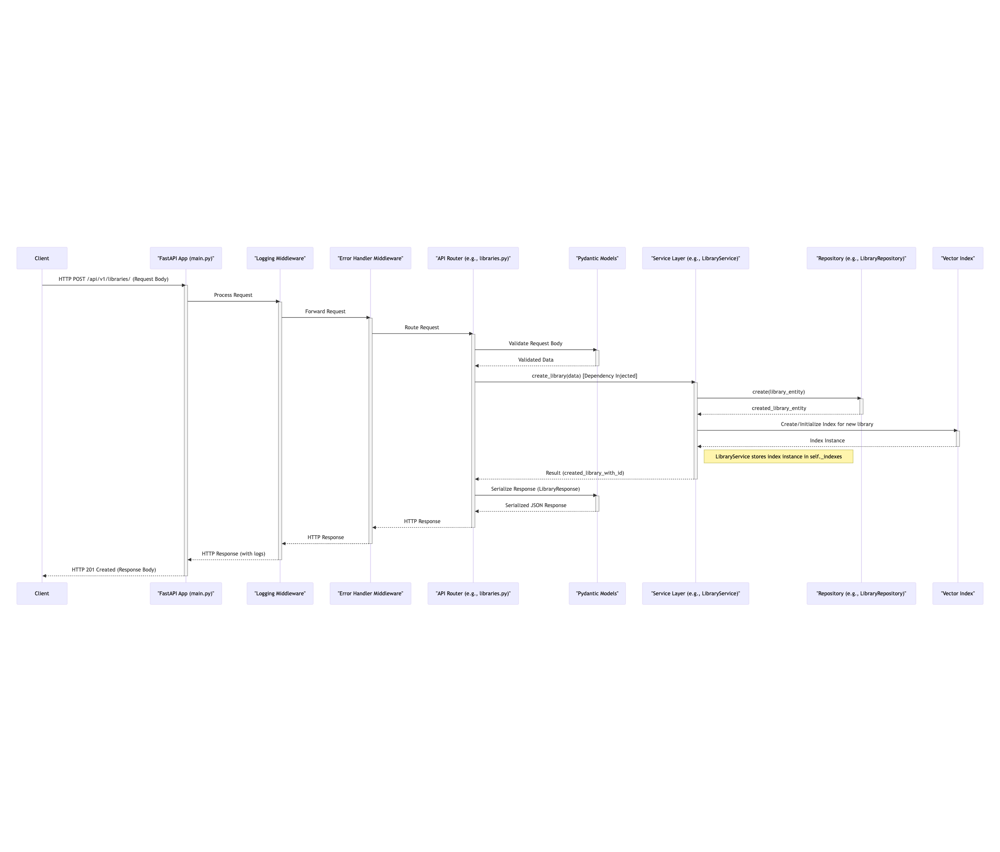
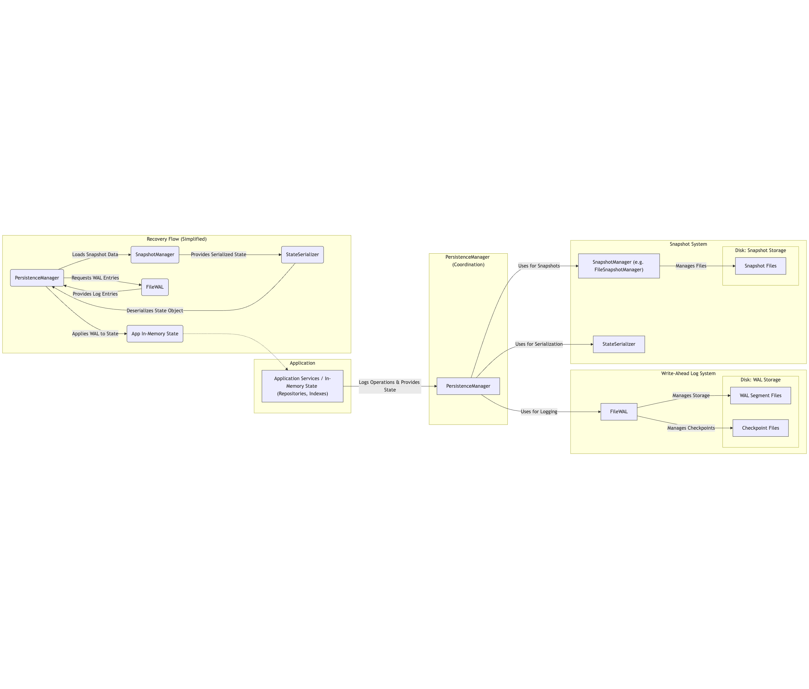
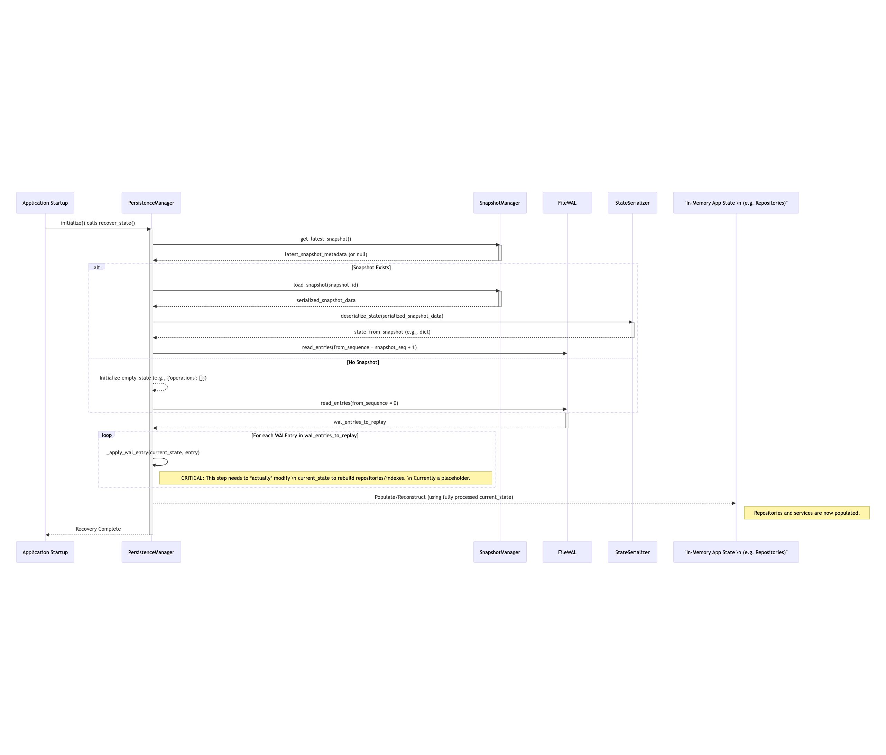

# Vector Database Architecture

## Executive Summary

The Vector Database API provides a scalable solution for indexing and querying document embeddings. The system implements multiple indexing algorithms from scratch, ensures thread-safe operations, and follows Domain-Driven Design principles. The architecture prioritizes modularity, performance, and maintainability while adhering to SOLID principles throughout the codebase.

## System Overview

### High-Level Architecture

The system employs a layered architecture pattern that separates concerns across multiple tiers:

```
┌─────────────────────────────────────────────────────────────┐
│                      External Clients                        │
│                    (HTTP/REST Interface)                     │
└─────────────────────────────────┬───────────────────────────┘
                                  │
┌─────────────────────────────────┴───────────────────────────┐
│                        API Layer                             │
│              (FastAPI Controllers & Routing)                 │
├─────────────────────────────────────────────────────────────┤
│                      Service Layer                           │
│           (Business Logic & Orchestration)                   │
├─────────────────────────────────────────────────────────────┤
│                     Repository Layer                         │
│              (Data Access Abstraction)                       │
├─────────────────────────────────────────────────────────────┤
│                 Infrastructure Layer                         │
│        (Indexes, Persistence, Caching, Locks)              │
└─────────────────────────────────────────────────────────────┘
```



### Core Components

The system consists of four main components that interact to provide the complete functionality:

1. **API Layer**: Handles HTTP requests, validates input, and returns responses
2. **Service Layer**: Implements business logic and coordinates between components
3. **Repository Layer**: Abstracts data access and provides a clean interface
4. **Infrastructure Layer**: Manages low-level operations including indexing and storage

## Domain Model

### Entity Design

The domain model consists of three primary entities that form the core of the system:

#### Library Entity
The Library entity represents a collection of documents with associated metadata and indexing configuration. Each library maintains its own vector index and can be configured with different indexing algorithms based on use case requirements.

Key attributes include:
- Unique identifier (UUID)
- Name and description
- Index type configuration (LSH, HNSW, or KD-Tree)
- Vector dimension specification
- Custom metadata fields
- Timestamp tracking for audit purposes

#### Document Entity
The Document entity serves as a logical grouping of related chunks within a library. Documents maintain relationships with their parent library and child chunks, facilitating hierarchical organization of content.

Key attributes include:
- Unique identifier (UUID)
- Reference to parent library
- Collection of associated chunks
- Document-level metadata
- Creation and modification timestamps

#### Chunk Entity
The Chunk entity represents the atomic unit of searchable content. Each chunk contains textual content, its vector embedding, and associated metadata. Chunks are immutable once created to ensure consistency in the vector index.

Key attributes include:
- Unique identifier (UUID)
- Text content
- Vector embedding (fixed-dimension float array)
- Reference to parent document
- Position within document
- Custom metadata fields

### Value Objects

The system employs several value objects to encapsulate domain concepts:

#### SearchQuery
Encapsulates all parameters required for vector similarity search:
- Query embedding vector
- Number of results (k)
- Metadata filters
- Target library identifier

#### SearchResult
Represents a single search result with similarity metrics:
- Matched chunk
- Distance score
- Relevance ranking
- Metadata highlights

#### IndexConfiguration
Defines parameters for vector index creation:
- Algorithm selection
- Algorithm-specific parameters
- Performance tuning options

## Indexing Algorithms

The system implements three distinct indexing algorithms, each optimized for different use cases and performance characteristics.

### Locality Sensitive Hashing (LSH)

LSH provides approximate nearest neighbor search with sub-linear query time. The implementation uses random hyperplane projection to create hash signatures for vectors.

**Algorithm Details:**
- The system generates multiple hash tables with different random projections
- Each vector gets hashed into buckets based on binary signatures
- Query vectors check only buckets with matching signatures
- Final candidates undergo exact distance calculation

**Performance Characteristics:**
- Search complexity: O(L × K) where L = number of tables, K = average bucket size
- Space complexity: O(n × L) where n = number of vectors
- Optimal for large datasets requiring fast approximate results

**Implementation Considerations:**
- Number of hash tables balances recall vs. performance
- Hash signature length affects collision probability
- Bucket size impacts query speed and accuracy

### Hierarchical Navigable Small World (HNSW)

HNSW creates a multi-layer graph structure that enables logarithmic search complexity. The algorithm builds connections between similar vectors at multiple scales.

**Algorithm Details:**
- Constructs hierarchical layers with exponentially decreasing node density
- Each node connects to M nearest neighbors within its layer
- Search navigates from top layer to bottom using greedy traversal
- Maintains both long-range and short-range connections

**Performance Characteristics:**
- Search complexity: O(log n) average case
- Space complexity: O(n × M) where M = maximum connections per node
- Excellent recall with tunable speed/accuracy tradeoff

**Implementation Considerations:**
- M parameter controls graph connectivity and memory usage
- ef_construction affects index build quality
- Layer assignment uses exponential decay probability

### KD-Tree with Random Projections

The implementation adapts traditional KD-Trees for high-dimensional vectors using random projection techniques to mitigate the curse of dimensionality.

**Algorithm Details:**
- Projects vectors to lower-dimensional subspace before partitioning
- Recursively divides space using median splits
- Maintains balanced tree structure
- Implements backtracking for k-nearest neighbor guarantee

**Performance Characteristics:**
- Search complexity: O(log n) best case, O(n) worst case
- Space complexity: O(n)
- Performs well for moderate dimensions with clustered data

**Implementation Considerations:**
- Random projection preserves distance relationships probabilistically
- Tree rebalancing maintains search efficiency
- Leaf size parameter affects tree depth vs. linear search tradeoff

## Concurrency Design

### Thread Safety Strategy

The system implements a  concurrency model to handle simultaneous read and write operations without data races.

#### Read-Write Lock Pattern
The implementation uses reader-writer locks with the following characteristics:
- Multiple concurrent readers allowed
- Writers obtain exclusive access
- Lock upgrading prevented to avoid deadlocks
- Fair scheduling prevents starvation

This approach minimizes lock hold time and ensures readers always see consistent state.

#### Lock Hierarchy
The system enforces a strict lock ordering to prevent deadlocks:
1. Library-level locks
2. Document-level locks
3. Chunk-level locks
4. Index-level locks

Locks must be acquired in this order and released in reverse order.



### Library Service

The Library Service manages the lifecycle of vector libraries and coordinates with other services.

**Responsibilities:**
- Library CRUD operations
- Index configuration management
- Metadata validation and storage
- Access control coordination

**Key Operations:**
- `create_library`: Initializes new library with specified index type
- `update_library`: Modifies library metadata and configuration
- `delete_library`: Removes library and associated resources
- `list_libraries`: Retrieves libraries with filtering and pagination

### Chunk Service

The Chunk Service handles chunk management and maintains index consistency.

**Responsibilities:**
- Chunk CRUD operations
- Embedding validation
- Index update coordination

**Key Operations:**
- `create_chunk`: Adds new chunk to library and index
- `update_chunk`: Modifies chunk content and re-indexes
- `delete_chunk`: Removes chunk and updates index

### Search Service

The Search Service executes vector similarity queries and applies post-processing.

**Responsibilities:**
- Query execution across indexes
- Metadata filter application
- Result ranking and scoring

**Key Operations:**
- `search`: Performs k-NN search in specified library
- `search_with_filters`: Applies metadata predicates to results

## API Design

### RESTful Endpoints

The API follows REST principles with resource-oriented URLs and standard HTTP methods.

#### Library Resources
```
POST   /api/v1/libraries                  # Create new library
GET    /api/v1/libraries                  # list all libraries
GET    /api/v1/libraries/{id}             # Get library details
PUT    /api/v1/libraries/{id}             # Update library
DELETE /api/v1/libraries/{id}             # Delete library
POST   /api/v1/libraries/{id}/index       # Rebuild index
```

#### Chunk Resources
```
POST   /api/v1/libraries/{lib_id}/chunks  # Create chunk
GET    /api/v1/libraries/{lib_id}/chunks  # list chunks
GET    /api/v1/chunks/{id}                # Get chunk details
PUT    /api/v1/chunks/{id}                # Update chunk
DELETE /api/v1/chunks/{id}                # Delete chunk
POST   /api/v1/libraries/{lib_id}/chunks/bulk # Bulk create
```

#### Search Operations
```
POST   /api/v1/libraries/{lib_id}/search  # Search in library
POST   /api/v1/search                     # Global search
```

### Request/Response Design

The API uses Pydantic models for request validation and response serialization.

#### Request Validation
- Type checking at runtime
- Automatic error responses for invalid input
- Custom validators for domain constraints
- Clear error messages with field-level details

#### Response Formatting
- Consistent envelope structure
- Pagination metadata for list endpoints
- HATEOAS links where applicable
- Proper HTTP status codes

### Error Handling

The system implements comprehensive error handling:

#### Error Categories
- 400: Client errors (validation, bad requests)
- 404: Resource not found
- 409: Conflict (concurrent modification)
- 500: Server errors (internal failures)

#### Error Response Format
```json
{
  "error": {
    "code": "RESOURCE_NOT_FOUND",
    "message": "Library with id '123' not found",
    "details": {
      "resource_type": "library",
      "resource_id": "123"
    }
  }
}
```



## Persistence Layer

### Write-Ahead Logging

The system implements write-ahead logging for durability:

1. **Log Structure**: Append-only log files with sequential writes
2. **Operation Recording**: All mutations logged before application
3. **Checkpointing**: Periodic snapshots reduce recovery time

### Snapshot Management

Periodic snapshots capture complete system state:

1. **Snapshot Creation**: Copy-on-write semantics minimize impact
2. **Incremental Snapshots**: Delta encoding reduces storage
3. **Snapshot Rotation**: Configurable retention policies
4. **Recovery Process**: Latest snapshot + WAL replay

### Data Formats

The persistence layer uses binary formats:




